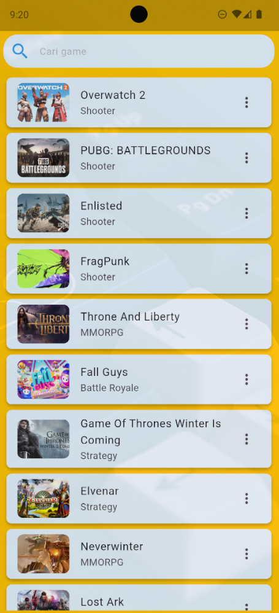
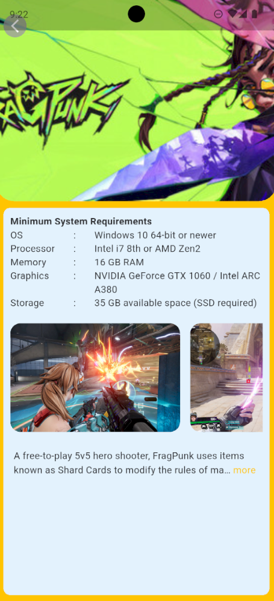

# 🎮 Aplikasi Katalog Game Flutter

Proyek ini adalah implementasi praktikum *Mobile Programming* menggunakan Flutter untuk membangun aplikasi katalog game. Aplikasi ini mengambil data dari API eksternal, menampilkannya dalam bentuk daftar, dan menyediakan halaman detail untuk setiap game.

Konsep utama yang diterapkan meliputi:
- Integrasi API
- *Asynchronous programming* dengan `FutureBuilder`
- Serialisasi JSON
- Navigasi menggunakan *named route*

---

## 📌 Tujuan

- Mendesain antarmuka (GUI) aplikasi Flutter yang interaktif dan responsif.
- Menerapkan sistem navigasi antarhalaman menggunakan mekanisme *named route*.
- Membuat model data dengan *JSON serialization* dan *deserialization*.
- Mengintegrasikan data dari API eksternal ke dalam aplikasi menggunakan paket `http`.
- Menampilkan data hasil permintaan API ke layar aplikasi dengan tata letak yang dinamis.

---

## 🚀 Langkah Kerja

1.  **Membuat Proyek Flutter Baru**
    - Buat proyek baru dengan nama `game_app`.

2.  **Menambahkan *Dependency***
    - Tambahkan paket berikut ke dalam file `pubspec.yaml`:

      ```yaml
      dependencies:
        flutter:
          sdk: flutter
        http: ^1.1.0
        json_annotation: ^4.9.0
        readmore: ^2.2.0

      dev_dependencies:
        build_runner: ^2.4.8
        json_serializable: ^6.7.1
      ```

    - Jalankan perintah di terminal untuk menginstal paket:
      ```bash
      flutter pub get
      ```

3.  **Implementasi File Utama**
    - **Struktur Proyek**: Atur kode ke dalam folder `model` (kelas data), `view` (UI), dan `viewmodel` (logika API).
    - **`model/game.dart` & `model/detailgame.dart`**: Berisi kelas model untuk data game yang dikonversi dari JSON.
    - **`viewmodel/fetchgame.dart`**: Berisi fungsi `fetchGames()` dan `fetchDataFromAPI()` untuk melakukan permintaan HTTP ke API `https://www.freetogame.com/api/`.
    - **`view/home.dart`**: Menampilkan daftar game menggunakan `FutureBuilder` dan `ListView.builder`.
    - **`view/detail.dart`**: Menampilkan informasi detail game yang dipilih, juga menggunakan `FutureBuilder`.
    - **`main.dart`**: Mengonfigurasi `MaterialApp` dengan `initialRoute` dan `routes` untuk menangani navigasi *named route* antar halaman.

4.  **Menjalankan Aplikasi**
    - Aplikasi menampilkan halaman *Home*. Saat item game diklik, aplikasi berpindah ke halaman *Detail* dengan mengirimkan ID game sebagai argumen.

---

## 📷 Screenshot

### 🏠 Halaman Home



- Latar belakang berwarna kuning.
- Menampilkan *search bar* di bagian atas.
- Menampilkan daftar game yang dapat di-*scroll*, masing-masing dengan gambar *thumbnail*, judul, dan genre.

### 🕹️ Halaman Detail



- Menampilkan gambar *header* game yang dipilih.
- Menyajikan informasi **Minimum System Requirements** dalam sebuah *card*.
- Menampilkan *screenshot* game yang dapat di-*scroll* secara horizontal.
- Menampilkan deskripsi game yang dapat diperluas (*read more*).

---

## ✅ Kesimpulan

- **`FutureBuilder`** memudahkan proses penampilan data dari API secara asinkron, termasuk menangani status *loading* dan *error*.
- Kombinasi **`ListView.builder`** dan **`Card`** efektif untuk membuat daftar item yang dinamis dan memiliki UI yang rapi.
- Navigasi dengan **`Navigator.pushNamed`** memungkinkan pengelolaan alur perpindahan halaman yang terstruktur dan mempermudah pengiriman data antar halaman.
- Paket **`json_serializable`** menyederhanakan konversi data JSON dari API menjadi objek Dart, membuat kode lebih bersih dan mudah dikelola.

---

📚 *Disusun untuk memenuhi tugas praktikum Mobile Programming.*