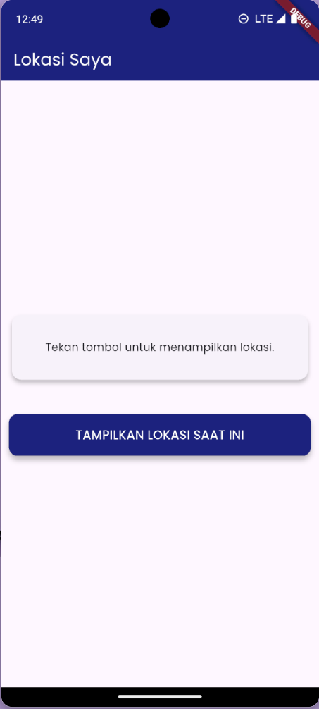
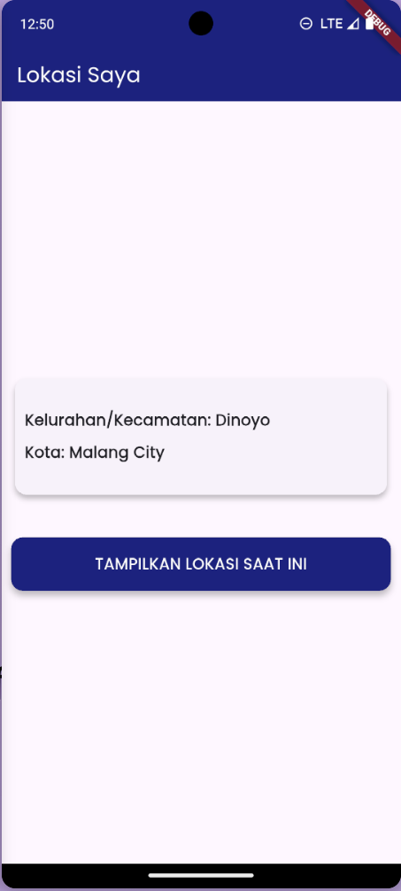

# ✨ Aplikasi Deteksi Lokasi Pengguna

Proyek ini adalah implementasi praktikum *Mobile Programming* menggunakan Flutter untuk membangun aplikasi yang dapat mendeteksi dan menampilkan lokasi pengguna saat ini. Aplikasi ini memanfaatkan sensor GPS perangkat untuk mendapatkan koordinat dan mengubahnya menjadi alamat yang dapat dibaca.

Konsep utama yang diterapkan meliputi:

- Manajemen state menggunakan `StatefulWidget` dan `setState`.
- Penggunaan package `geolocator` untuk mengakses data GPS.
- Penggunaan package `geocoding` untuk melakukan *reverse geocoding* (koordinat ke alamat).
- Penanganan izin (permission) untuk mengakses lokasi.
- Menampilkan UI yang responsif terhadap state (loading, error, dan sukses).

-----

## 📌 Tujuan

- Memahami cara kerja `StatefulWidget` untuk mengelola state yang dinamis.
- Mengintegrasikan package eksternal dari pub.dev untuk mengakses fungsionalitas native.
- Mengimplementasikan alur permintaan izin (permission request) kepada pengguna.
- Menangani proses asynchronous seperti mengambil data lokasi dari sensor.
- Menampilkan data yang didapat dari proses asynchronous ke dalam UI Flutter.

-----

## 🚀 Langkah Kerja

1.  **Struktur Proyek**

    - Seluruh logika dan tampilan aplikasi ini berada dalam satu file utama.
      ```
      lib/
      └── main.dart
      ```

2.  **Menambahkan *Dependency***

    - Tambahkan paket berikut ke dalam file `pubspec.yaml`:
      ```yaml
      dependencies:
        flutter:
          sdk: flutter
        google_fonts: ^6.1.0
        geolocator: ^9.0.2
        geocoding: ^2.0.4
      ```
    - Jalankan perintah di terminal untuk menginstal paket:
      ```bash
      flutter pub get
      ```

3.  **Implementasi File Utama (`lib/main.dart`)**

    - **`GeolocationScreen`**: Merupakan sebuah `StatefulWidget` yang menjadi inti dari aplikasi. Widget ini mengelola state seperti `_kecamatan`, `_kota`, `_isLoading`, dan `_errorMessage`.
    - **`_getLocation()`**: Method asynchronous ini adalah pusat logika aplikasi.
        1.  Memeriksa apakah layanan lokasi di perangkat aktif.
        2.  Memeriksa dan meminta izin akses lokasi kepada pengguna.
        3.  Jika diizinkan, mengambil posisi (latitude dan longitude) saat ini menggunakan `Geolocator.getCurrentPosition()`.
        4.  Menggunakan `placemarkFromCoordinates()` dari package `geocoding` untuk mengubah data posisi menjadi alamat (placemark).
        5.  Memperbarui state `_kecamatan` dan `_kota` menggunakan `setState()` dengan data dari placemark, yang kemudian secara otomatis me-render ulang UI untuk menampilkan lokasi.
    - **UI (build method)**: Tampilan dirancang untuk merespons perubahan state:
        - Menampilkan `CircularProgressIndicator` saat `_isLoading` bernilai `true`.
        - Menampilkan pesan error jika `_errorMessage` tidak null.
        - Menampilkan data lokasi (`_kecamatan` dan `_kota`) jika berhasil didapatkan.
        - Sebuah tombol `ElevatedButton` memicu pemanggilan method `_getLocation()`.

4.  **Menjalankan Aplikasi**

    - Aplikasi akan menampilkan sebuah kartu dan tombol. Saat tombol "TAMPILKAN LOKASI SAAT INI" ditekan, aplikasi akan meminta izin lokasi. Setelah disetujui, aplikasi akan menampilkan nama kecamatan dan kota berdasarkan lokasi GPS pengguna.

-----

## 📷 Screenshot


*Tampilan awal sebelum lokasi dideteksi.*


*Tampilan setelah lokasi berhasil dideteksi dan ditampilkan di kartu.*

-----

## ✅ Kesimpulan

- **StatefulWidget** efektif untuk mengelola state sederhana dan proses asynchronous dalam satu layar. `setState()` digunakan untuk memicu pembaruan UI setelah data diterima.
- **Integrasi Package**: Proyek ini menunjukkan kemudahan Flutter dalam mengintegrasikan fungsionalitas native (seperti GPS) melalui package pihak ketiga (`geolocator` dan `geocoding`).
- **Asynchronous Flow**: Penggunaan `async/await` dengan `try-catch` adalah pola yang kuat untuk menangani operasi yang memakan waktu (seperti I/O atau permintaan hardware) dan mengelola kemungkinan error dengan baik.
- **User Experience**: Dengan menangani state `loading` dan `error`, aplikasi memberikan feedback yang jelas kepada pengguna selama proses deteksi lokasi.

-----

📚 *Readme ini dibuat berdasarkan modul praktikum Mobile Programming.*
