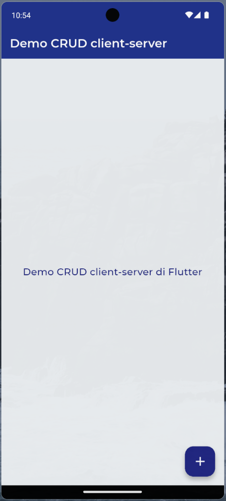
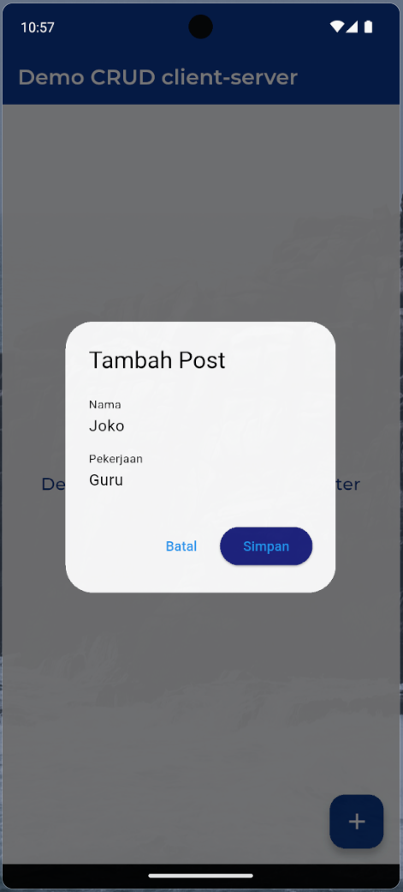
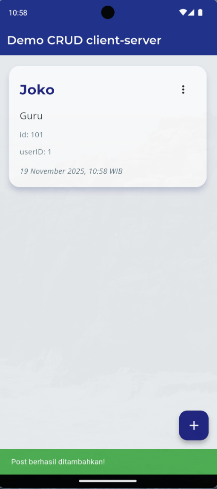
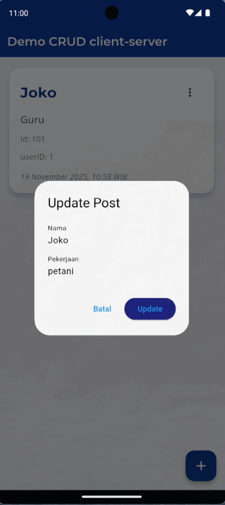
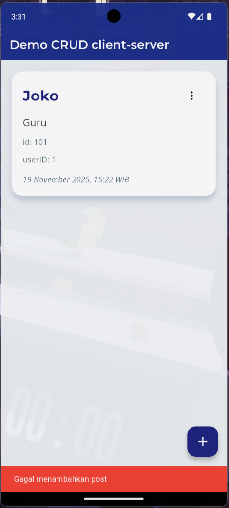

---

# 📝 Latihan 13 – CRUD Flutter dengan REST API


Aplikasi ini merupakan implementasi **CRUD (Create, Read, Update, Delete)** pada Flutter menggunakan **REST API**, sesuai materi praktikum **Modul 13**.
Pengguna dapat menambahkan data, mengubah data, menghapus data, dan melihat daftar data langsung melalui antarmuka interaktif menggunakan Flutter.

---

## 🎯 Tujuan Praktikum

* Memahami implementasi CRUD pada Flutter menggunakan REST API.
* Menggunakan package **HTTP** untuk komunikasi client–server.
* Mengelola data dinamis dengan parsing JSON.
* Membuat UI interaktif menggunakan **Card**, **AlertDialog**, dan **PopupMenuButton**.
* Menangani error respons server dan validasi input.
* Menggunakan `setState()` untuk memperbarui tampilan secara realtime setiap perubahan state.

---

## 📁 Struktur Proyek

```
modul13/latihan13/
│
├── lib/
│   ├── main.dart
│   ├── post_model.dart
│   ├── api_service.dart
│   ├── home_page.dart
│   └── widgets/
│       └── post_card.dart
│
├── assets/
│   └── (opsional)
│
└── screenshot/
    ├── Awal.png
    ├── Tambah.png
    ├── Update.png
    ├── Card.png
    ├── gagaltambah.png
    ├── nama&pekerjaanharusdiisi.png
```

---

## 📦 Dependensi

Tambahkan pada `pubspec.yaml`:

```yaml
dependencies:
  flutter:
    sdk: flutter
  http: ^1.2.0
  intl: ^0.18.1
  google_fonts: ^6.1.0
```

Lalu jalankan:

```
flutter pub get
```

---

## ⚙️ Fitur CRUD

### ✔ Create (Tambah Data)

* Menggunakan **AlertDialog** untuk input nama & pekerjaan
* Mengirim POST request ke API
* Validasi input kosong
* SnackBar hijau jika berhasil, merah jika gagal

### ✔ Read (Tampilkan Data)

* Mengambil semua data dari server
* Menampilkan menggunakan widget **Card**

### ✔ Update (Perbarui Data)

* PopupMenuButton → pilih **Edit**
* Menampilkan dialog update
* Mengirim PUT request

### ✔ Delete (Hapus Data)

* PopupMenuButton → pilih **Delete**
* Muncul dialog konfirmasi
* Mengirim DELETE request

---

## 🖼️ Screenshot Aplikasi

> Letakkan file screenshot di folder `/screenshot`, lalu gunakan link relative.

### 🏁 Tampilan Awal



### ➕ Dialog Tambah Data



### 📄 Data Berhasil Ditampilkan dalam Card



### ✏ Dialog Update Data



### ❌ Validasi Gagal – Input Wajib Diisi


### ⚠ SnackBar Error – Gagal Tambah Data



---

## 🧪 Cara Menjalankan

```
flutter run
```

Pastikan device emulator / HP sudah aktif.

---

## 📝 Kesimpulan

* CRUD di Flutter dapat diimplementasikan dengan mudah menggunakan **http** package.
* `setState()` efektif memperbarui UI setelah operasi CRUD.
* Pemodelan data dengan class model membantu parsing JSON menjadi objek Dart.
* Validasi input dan error handling sangat penting agar aplikasi tidak mudah crash.
* Dialog interaktif memudahkan pengalaman pengguna dalam mengelola data.

---
