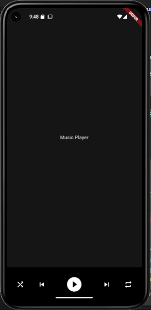

# 🎵 Control Bar Pemutar Musik

Proyek ini adalah implementasi praktikum **Mobile Programming** menggunakan Flutter untuk membuat **control bar pemutar musik** dengan widget **Row, Expanded, dan Flexible**.

## 📌 Tujuan
- Memahami penggunaan widget `Row`, `Expanded`, dan `Flexible`.  
- Mempelajari cara mendistribusikan ruang antar tombol kontrol musik.  
- Mengetahui perbedaan efek penggunaan `Expanded` dan `Flexible`.  

## 🚀 Langkah Kerja
1. Membuat proyek Flutter baru dan mengatur tema dengan `ThemeData.dark()`.  
2. Menggunakan `Scaffold` dengan properti `bottomNavigationBar`.  
3. Membuat fungsi `controlBar` yang membungkus `Container` dengan warna latar `Colors.black54`.  
4. Menambahkan **Row** berisi lima ikon kontrol musik:  
   - Shuffle  
   - Previous  
   - Play (lebih besar dengan `Flexible`)  
   - Next  
   - Repeat  
5. Mengatur tata letak menggunakan kombinasi **Expanded** dan **Flexible**.  

## 📷 Screenshot
Tampilan hasil pada emulator:  

## ✅ Kesimpulan
- Tombol dapat ditampilkan dengan ukuran berbeda tanpa mengganggu tata letak.  
- Kombinasi `Expanded` dan `Flexible` memudahkan distribusi ruang UI.  
- Konsep ini dapat diterapkan untuk membuat control bar aplikasi musik sederhana.  
