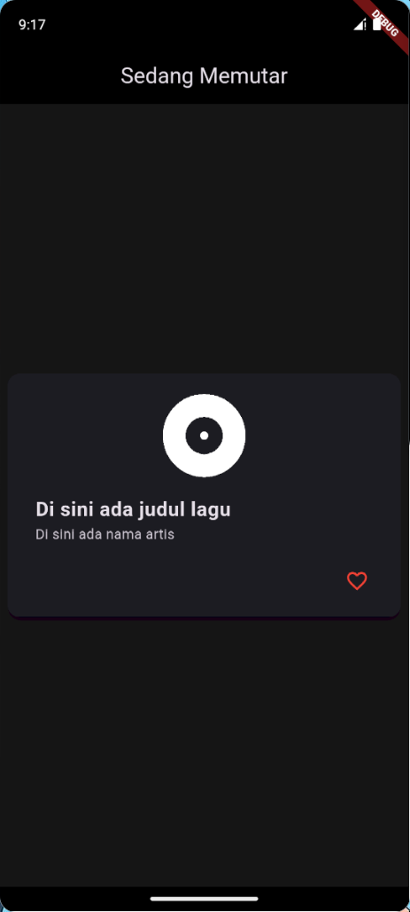

# 🎶 UI Pemutar Musik dengan Card

Proyek ini adalah implementasi praktikum **Mobile Programming** menggunakan Flutter untuk membuat **tampilan informasi musik yang sedang diputar** dengan widget **Card, SizedBox, dan Spacer**.

## 📌 Tujuan
- Memahami penggunaan widget `Card` untuk menampilkan konten dengan gaya material design.  
- Mengatur tata letak agar proporsional menggunakan kombinasi `SizedBox` dan `Spacer`.  
- Menambahkan ikon album, judul lagu, nama artis, serta tombol aksi **Like** (Favorite).  

## 🚀 Langkah Kerja
1. Membuat proyek Flutter baru dengan tema `ThemeData.dark()`.  
2. Menggunakan `Scaffold` dengan `AppBar` berjudul *"Sedang Memutar"*.  
3. Menambahkan widget `Card` di dalam `Center` untuk membungkus seluruh informasi musik.  
4. Isi `Card` terdiri dari:  
   - Ikon **Album** (`Icons.album_rounded`) berukuran besar.  
   - `ListTile` untuk menampilkan **judul lagu** (title) dan **nama artis** (subtitle).  
   - `Row` dengan `SizedBox` dan `Spacer` untuk mengatur posisi tombol aksi.  
   - Tombol aksi berupa `IconButton` dengan ikon **Favorite** (`Icons.favorite_border`) berwarna merah.  
5. Memberikan padding dan margin agar tampilan rapi dan proporsional.  

## 📷 Screenshot
Tampilan hasil pada emulator:  

## ✅ Kesimpulan
- Widget `Card` sangat cocok digunakan untuk menampilkan informasi yang terpisah dengan tampilan elegan.  
- Kombinasi `SizedBox` dan `Spacer` membantu menjaga proporsi tata letak.  
- Konsep ini dapat diterapkan pada aplikasi musik nyata untuk menampilkan detail lagu yang sedang diputar.  
