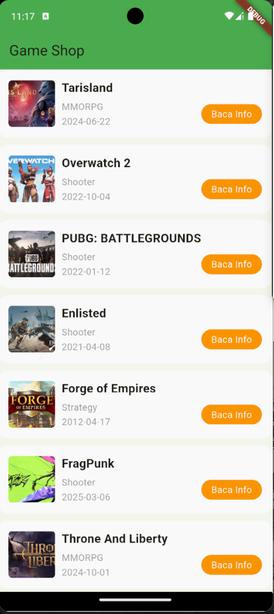

# 🎮 Daftar Game dengan ListView.builder

Proyek ini adalah implementasi praktikum **Mobile Programming** menggunakan Flutter untuk membuat **daftar game** dengan widget **ListView.builder**. Data game diambil dari API [FreeToGame](https://www.freetogame.com/api/games).  

## 📌 Tujuan
- Memahami penggunaan `ListView.builder` untuk menampilkan data dinamis dalam bentuk daftar.  
- Menggunakan kombinasi widget `Container`, `Row`, `Column`, dan `ClipRRect` agar tata letak item daftar lebih rapi.  
- Menampilkan informasi game secara konsisten meliputi:  
  - Gambar thumbnail  
  - Judul game  
  - Genre  
  - Tanggal rilis  
  - Tombol aksi untuk membaca detail informasi  

## 🚀 Langkah Kerja
1. Membuat proyek Flutter baru dengan nama **game_shop**.  
2. Menambahkan dependency **http** di `pubspec.yaml` untuk request API.  
3. Membuat fungsi `_ambilData` untuk mengambil data game dari API.  
4. Menyimpan data hasil request ke dalam list `dataGame`.  
5. Menggunakan `ListView.builder` untuk menampilkan daftar game.  
6. Membuat fungsi `_listItem` dengan susunan tata letak:  
   - **Container** sebagai pembungkus utama dengan background putih dan sudut melengkung.  
   - **Row** untuk menata thumbnail dan informasi di sampingnya.  
   - **ClipRRect** untuk menampilkan thumbnail dengan border radius.  
   - **Column** untuk menampilkan teks judul, genre, dan tanggal rilis.  
   - Tombol **Baca Info** dalam bentuk `Container` berwarna oranye dengan teks putih.  

## 📷 Screenshot
Tampilan hasil pada emulator:  

## ✅ Kesimpulan
- `ListView.builder` memudahkan pembuatan daftar dinamis yang datanya diambil dari API.  
- Widget `Container`, `Row`, `Column`, dan `ClipRRect` dapat digabungkan untuk menghasilkan tampilan yang konsisten dan menarik.  
- Tombol aksi dapat ditambahkan pada tiap item untuk memberi interaksi lebih lanjut, misalnya menuju halaman detail game.  
- Konsep ini dapat diperluas menjadi aplikasi katalog game yang lebih kompleks dengan fitur pencarian dan filter.  

