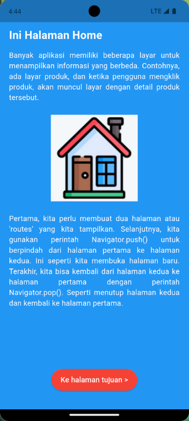
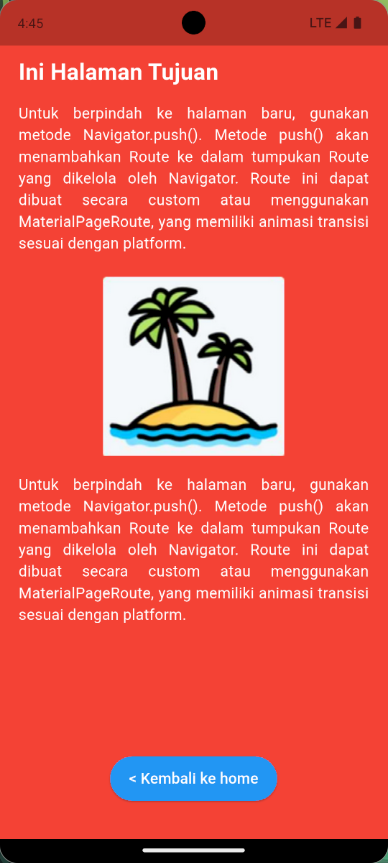

# 📱 Navigasi dengan Named Route di Flutter  

Proyek ini adalah implementasi praktikum **Mobile Programming** menggunakan Flutter untuk memahami **navigasi antar halaman** menggunakan **Named Route**. Aplikasi memiliki dua halaman utama, yaitu **Halaman Home** dan **Halaman Tujuan**, dengan tampilan berbeda sesuai kebutuhan.  

---

## 📌 Tujuan  
- Memahami konsep **Named Route** pada Flutter.  
- Membuat dua halaman dengan background dan konten berbeda.  
- Menampilkan teks penjelasan panjang dengan **align justify**.  
- Menampilkan gambar pada masing-masing halaman.  
- Membuat tombol untuk **berpindah halaman** menggunakan `Navigator.pushNamed()` dan **kembali** menggunakan `Navigator.pop()`.  

---

## 🚀 Langkah Kerja  
1. Membuat proyek Flutter baru dengan nama **flutter_navigasi**.  
2. Membuat tiga file utama:  
   - `main.dart` → mendefinisikan `routes` dan `initialRoute`.  
   - `home.dart` → berisi halaman utama dengan background biru.  
   - `tujuan.dart` → berisi halaman tujuan dengan background merah.  
3. Menambahkan widget `Container`, `Column`, `Text`, `Image.asset`, dan `ElevatedButton` untuk membentuk layout sesuai desain.  
4. Menambahkan gambar di folder `assets/` lalu mendaftarkan pada `pubspec.yaml`.  
5. Menambahkan tombol navigasi:  
   - **Home → Tujuan** dengan `Navigator.pushNamed(context, '/tujuan')`.  
   - **Tujuan → Home** dengan `Navigator.pop(context)`.  
6. Menjalankan aplikasi untuk melihat hasil navigasi antar halaman.  

---

## 📷 Screenshot  

### Halaman Home  
- Background biru  
- Judul besar **"Ini Halaman Home"**  
- Penjelasan panjang di bawah judul  
- Gambar ikon di tengah  
- Tombol **"Ke halaman tujuan"** di bagian bawah  

  

### Halaman Tujuan  
- Background merah  
- Judul besar **"Ini Halaman Tujuan"**  
- Penjelasan panjang di bawah judul  
- Gambar ikon di tengah  
- Tombol **"Kembali ke home"** di bagian bawah  

  

---

## ✅ Kesimpulan  
- **Named Route** memudahkan pengaturan navigasi antar halaman karena setiap halaman diberi nama unik yang bisa dipanggil langsung.  
- Kombinasi `Container`, `Column`, `Text`, `Image.asset`, dan `ElevatedButton` bisa digunakan untuk membuat layout rapi dengan background warna berbeda.  
- Dengan `Navigator.pushNamed()` pengguna bisa berpindah ke halaman baru, dan dengan `Navigator.pop()` pengguna bisa kembali ke halaman sebelumnya.  
- Konsep ini menjadi dasar untuk membangun aplikasi Flutter multi-halaman yang lebih kompleks.  
