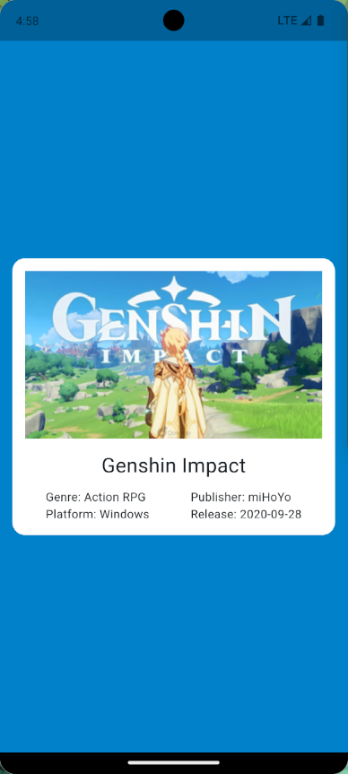
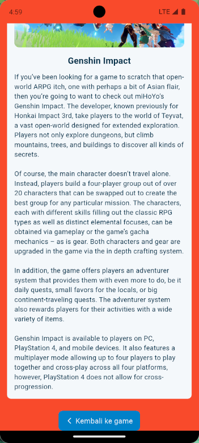

```markdown
# 🎮 Navigasi dengan Named Route & API FreeToGame di Flutter  

Proyek ini adalah implementasi praktikum **Mobile Programming** menggunakan Flutter untuk memahami **navigasi antar halaman** dengan **Named Route**, sekaligus menampilkan data dari **API FreeToGame**. Aplikasi memiliki dua halaman utama, yaitu **Halaman Home** (menampilkan informasi singkat sebuah game) dan **Halaman Tujuan** (menampilkan detail lengkap game).  

---

## 📌 Tujuan  
- Memahami konsep **Named Route** pada Flutter.  
- Mengambil data game dari **API FreeToGame**.  
- Menampilkan informasi game (judul, cover, genre, platform, publisher, release).  
- Membawa data antar halaman dengan class **ScreenArguments**.  
- Membuat tombol untuk **berpindah halaman** menggunakan `Navigator.pushNamed()` dan **kembali** menggunakan `Navigator.pop()`.  

---

## 🚀 Langkah Kerja  
1. Membuat proyek Flutter baru dengan nama **navigasi_argumen**.  
2. Membuat struktur file:  
```

lib/
├─ main.dart
├─ home.dart
├─ tujuan.dart
└─ screen_arguments.dart

````
3. Tambahkan dependency `http` di `pubspec.yaml`:  
```yaml
dependencies:
  flutter:
    sdk: flutter
  http: ^1.5
````

Lalu jalankan:

```bash
flutter pub get
```

4. Implementasi file:

   * **`screen_arguments.dart`** → class model sederhana untuk membawa data antar halaman.
   * **`main.dart`** → mendefinisikan `routes` dan `initialRoute`.
   * **`home.dart`** → mengambil data game dari API FreeToGame dan menampilkannya di halaman utama.
   * **`tujuan.dart`** → menerima data dari `ScreenArguments` dan menampilkan detail game.
5. Pada `Home`, data game diambil lewat method `getGame()` menggunakan **http request** ke FreeToGame API.
6. Saat item game ditekan, aplikasi mengirim data ke halaman Tujuan melalui `Navigator.pushNamed()`.
7. Pada halaman Tujuan, data ditampilkan lebih detail (cover, judul, deskripsi lengkap).
8. Tambahkan tombol kembali dengan `Navigator.pop(context)` untuk kembali ke Home.

---

## 📷 Screenshot

### Halaman Home

* Background biru
* Menampilkan thumbnail, judul, genre, platform, publisher, release date
* Klik item game → pindah ke Halaman Tujuan



### Halaman Tujuan

* Background merah
* Menampilkan cover, judul, dan deskripsi lengkap
* Tombol **"Kembali ke game"** untuk kembali ke Home



---

## ✅ Kesimpulan

* **Named Route** memudahkan pengaturan navigasi antar halaman.
* **ScreenArguments** sangat berguna untuk membawa data kompleks (gambar, teks, deskripsi) antar halaman.
* Dengan memanfaatkan **http request**, aplikasi bisa menampilkan data dinamis dari API eksternal.
* Konsep ini menjadi dasar untuk membangun aplikasi Flutter multi-halaman yang lebih interaktif dan real-time.

```
