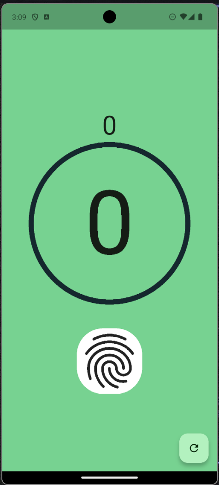

# 📿 Aplikasi Tasbih Digital Flutter  

Proyek ini adalah implementasi praktikum **Mobile Programming** menggunakan Flutter untuk memahami penggunaan **Stateful Widget**, **ValueNotifier**, serta penerapan **circular progress bar**. Aplikasi ini berfungsi sebagai **tasbih digital**, yang dapat menghitung hingga 33 kali, menampilkan progres dalam bentuk lingkaran, serta menyediakan tombol reset.  

## 📌 Tujuan  
- Memahami konsep **Stateful Widget** pada Flutter.  
- Menggunakan **ValueNotifier** untuk mengontrol circular progress bar secara real-time.  
- Mengelola state dengan `setState()` agar UI dapat diperbarui sesuai interaksi.  
- Membuat tombol interaktif menggunakan **InkWell** dan **FloatingActionButton**.  
- Menerapkan **simple_circular_progress_bar** sebagai representasi visual counter.  

## 🚀 Langkah Kerja  
1. Membuat proyek Flutter baru dengan nama **tasbih_app**.  
2. Tambahkan dependency di `pubspec.yaml`:  
```yaml
dependencies:
  flutter:
    sdk: flutter
  simple_circular_progress_bar: ^1.0.2
````

Lalu jalankan:

```bash
flutter pub get
```

3. Implementasi file utama:

   * **`main.dart`** → berisi StatefulWidget `MyApp`, pengaturan `ValueNotifier`, counter, serta UI aplikasi.
   * Method `incrementCounter()` → menambah nilai counter (maksimal 33).
   * Method `resetCounter()` → mengembalikan nilai counter ke 0.
   * Widget utama: `Text`, `SimpleCircularProgressBar`, `InkWell`, `FloatingActionButton`.

4. Jalankan aplikasi, lalu coba interaksi:

   * Klik tombol fingerprint untuk menambah hitungan.
   * Tekan tombol refresh untuk reset hitungan ke nol.

## 📷 Screenshot

### Halaman Utama

* Background hijau
* Menampilkan angka hitungan di atas progress bar
* Lingkaran progres bertambah sesuai jumlah counter
* Tombol fingerprint (putih) → menambah counter
* Tombol refresh (kanan bawah) → reset counter



## ✅ Kesimpulan

* **Stateful Widget** memungkinkan perubahan UI sesuai interaksi pengguna.
* **ValueNotifier** efektif untuk mengontrol circular progress bar secara dinamis.
* **setState()** memastikan setiap perubahan nilai langsung diperbarui ke tampilan.
* **InkWell** dan **FloatingActionButton** memberikan interaksi tombol yang sederhana dan responsif.
* Dengan memanfaatkan circular progress bar, aplikasi tasbih lebih intuitif dan menarik secara visual.

