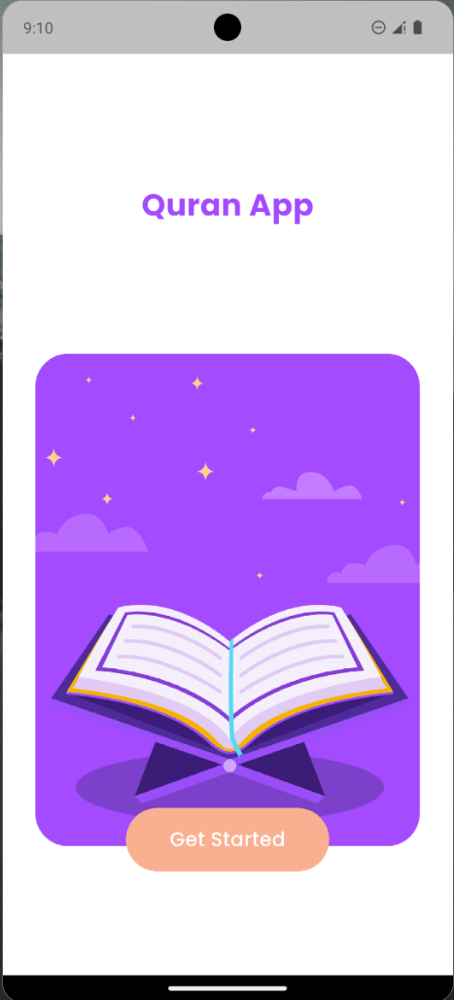
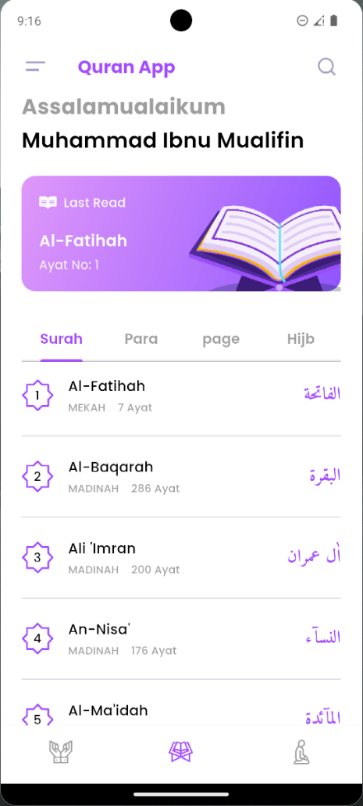
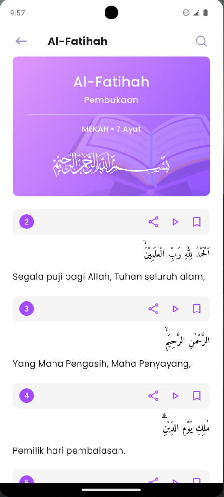

# 📖 Quran App

Quran App adalah aplikasi mobile berbasis **Flutter** yang dirancang untuk membantu pengguna membaca, memahami, dan mempelajari Al-Qur’an secara digital.  
Aplikasi ini menampilkan daftar 114 surah lengkap beserta teks Arab, terjemahan bahasa Indonesia, dan informasi surah secara interaktif dengan tampilan modern dan elegan.

---

## 🚀 Fitur Utama

- 📜 **Daftar Surah Lengkap**  
  Menampilkan seluruh 114 surah Al-Qur’an dengan nama Arab, nama latin, tempat turunnya, dan jumlah ayat.

- 🕋 **Detail Surah dan Ayat**  
  Menampilkan teks Arab setiap ayat beserta terjemahan Bahasa Indonesia (sumber: Kemenag RI).

- 🎨 **Desain Antarmuka Modern**  
  Menggunakan tema warna lembut, ikon SVG, dan tipografi dari Google Fonts (Poppins & Amiri).

- 📖 **Last Read Section**  
  Menampilkan surah dan ayat terakhir yang dibaca oleh pengguna.

- ⚡ **Akses Offline**  
  Semua data disimpan dalam format JSON lokal di folder `assets/`, sehingga dapat digunakan tanpa koneksi internet.

---

## 📸 Screenshots

| Splash Screen | Home Screen | Detail Surah Screen |
|:---:|:---:|:---:|
|  |  | |  | 

---

## 📁 Struktur Proyek
